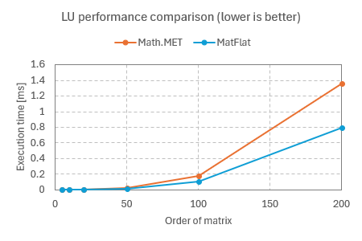
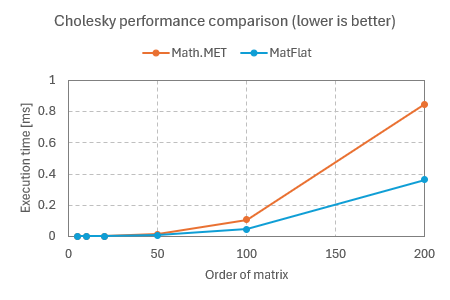
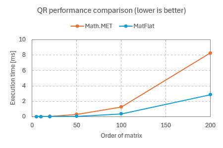
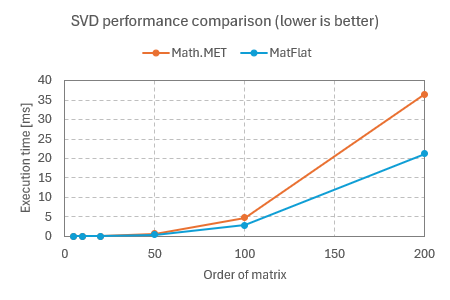

# MatFlat

This library aims to provide a pure C# implementation of reasonably fast low-level routines for linear algebra operations.

This library is based on the following great projects:

* [Math.NET Numerics](https://github.com/mathnet/mathnet-numerics)
* [Accord.NET](https://github.com/accord-net/framework)
* [Mapack Matrix Package](https://github.com/sinshu/mapack)

Currently the following routines are implemented:

* LU decomposition
* Cholesky decomposition
* QR decomposition
* Singular value decomposition
* Generalized eigenvalue decomposition
* Forward and backward substitution


## Features

* Supports `float`, `double`, and `Complex` matrices.
* Faster than the managed matrix decompositions in Math.NET in many cases.
* Small code size, with no dependencies other than .NET 8.
* No internal multi-threaded optimization, making it safe to use in any multi-threaded code.
* BLAS and LAPACK-like interface that allows arbitrary leading dimension.


## Limitations

* Unsafe pointers are required, similar to the original BLAS and LAPACK routines.
* Only column-major order is supported.
* GEVD supports only symmetric matrices.


## Installation

.NET 8 is required.

[The NuGet package](https://www.nuget.org/packages/MatFlat) is available.

```ps1
Install-Package MatFlat
```

All the classes are in the `MatFlat` namespace.

```cs
using MatFlat;
```


## Performance

The following is a performance comparison with the managed implementation in Math.NET Numerics.
The execution times of various `double` matrix decompositions for square matrices were measured.
The matrix sizes range from 5x5 to 200x200.

### Measurement condition

The benchmarks were run under the following conditions:

```
BenchmarkDotNet v0.13.12, Windows 11 (10.0.22631.3296/23H2/2023Update/SunValley3)
12th Gen Intel Core i7-12700K, 1 CPU, 20 logical and 12 physical cores
.NET SDK 8.0.202
  [Host]     : .NET 8.0.3 (8.0.324.11423), X64 RyuJIT AVX2
  DefaultJob : .NET 8.0.3 (8.0.324.11423), X64 RyuJIT AVX2
```

### LU decomposition

| Method  | Order | Mean            | Error        | StdDev       | Gen0   | Allocated |
|-------- |------ |----------------:|-------------:|-------------:|-------:|----------:|
| **MathNet** | **5**     |        **79.40 ns** |     **0.139 ns** |     **0.130 ns** | **0.0049** |      **64 B** |
| MatFlat | 5     |        95.05 ns |     0.226 ns |     0.200 ns |      - |         - |
| **MathNet** | **10**    |       **357.11 ns** |     **2.120 ns** |     **1.983 ns** | **0.0076** |     **104 B** |
| MatFlat | 10    |       315.61 ns |     3.603 ns |     3.370 ns |      - |         - |
| **MathNet** | **20**    |     **1,919.06 ns** |    **12.070 ns** |    **11.290 ns** | **0.0114** |     **184 B** |
| MatFlat | 20    |     1,477.05 ns |     7.740 ns |     7.240 ns |      - |         - |
| **MathNet** | **50**    |    **25,544.68 ns** |   **125.243 ns** |   **117.152 ns** | **0.0305** |     **424 B** |
| MatFlat | 50    |    14,749.34 ns |    23.885 ns |    21.174 ns |      - |         - |
| **MathNet** | **100**   |   **178,305.77 ns** |   **664.818 ns** |   **621.871 ns** |      **-** |     **824 B** |
| MatFlat | 100   |   103,991.50 ns |   237.204 ns |   198.076 ns |      - |         - |
| **MathNet** | **200**   | **1,363,118.63 ns** | **3,265.866 ns** | **3,054.893 ns** |      **-** |    **1625 B** |
| MatFlat | 200   |   797,660.58 ns | 3,207.267 ns | 2,843.159 ns |      - |       1 B |



### Cholesky decomposition

| Method  | Order | Mean          | Error         | StdDev        | Gen0   | Allocated |
|-------- |------ |--------------:|--------------:|--------------:|-------:|----------:|
| **MathNet** | **5**     |      **57.38 ns** |      **0.202 ns** |      **0.189 ns** | **0.0263** |     **344 B** |
| MatFlat | 5     |      34.32 ns |      0.077 ns |      0.068 ns |      - |         - |
| **MathNet** | **10**    |     **196.48 ns** |      **0.446 ns** |      **0.417 ns** | **0.0508** |     **664 B** |
| MatFlat | 10    |     145.42 ns |      0.302 ns |      0.283 ns |      - |         - |
| **MathNet** | **20**    |   **1,058.98 ns** |      **3.243 ns** |      **3.033 ns** | **0.0992** |    **1304 B** |
| MatFlat | 20    |     786.09 ns |      1.664 ns |      1.556 ns |      - |         - |
| **MathNet** | **50**    |  **13,813.05 ns** |     **54.198 ns** |     **50.697 ns** | **0.2441** |    **3224 B** |
| MatFlat | 50    |   7,687.34 ns |     32.545 ns |     30.442 ns |      - |         - |
| **MathNet** | **100**   | **106,477.52 ns** |    **478.292 ns** |    **447.395 ns** | **0.4883** |    **6424 B** |
| MatFlat | 100   |  47,260.82 ns |    259.007 ns |    242.275 ns |      - |         - |
| **MathNet** | **200**   | **847,155.59 ns** | **14,113.388 ns** | **13,201.672 ns** | **0.9766** |   **12824 B** |
| MatFlat | 200   | 364,254.50 ns |  1,320.133 ns |  1,102.371 ns |      - |         - |



### QR decomposition

| Method  | Order | Mean           | Error        | StdDev       | Gen0     | Gen1    | Gen2    | Allocated |
|-------- |------ |---------------:|-------------:|-------------:|---------:|--------:|--------:|----------:|
| **MathNet** | **5**     |     **6,427.4 ns** |     **43.51 ns** |     **40.70 ns** |   **1.0300** |       **-** |       **-** |   **13472 B** |
| MatFlat | 5     |       169.0 ns |      0.82 ns |      0.73 ns |        - |       - |       - |         - |
| **MathNet** | **10**    |    **16,323.8 ns** |    **204.25 ns** |    **191.06 ns** |   **2.2583** |       **-** |       **-** |   **29404 B** |
| MatFlat | 10    |       673.1 ns |      2.95 ns |      2.76 ns |        - |       - |       - |         - |
| **MathNet** | **20**    |    **52,568.1 ns** |    **272.42 ns** |    **254.82 ns** |   **5.2490** |  **0.0610** |       **-** |   **68239 B** |
| MatFlat | 20    |     4,525.4 ns |     12.39 ns |     10.98 ns |        - |       - |       - |         - |
| **MathNet** | **50**    |   **288,599.5 ns** |  **1,617.16 ns** |  **1,512.69 ns** |  **14.6484** |  **0.9766** |       **-** |  **201068 B** |
| MatFlat | 50    |    47,460.2 ns |     64.49 ns |     53.85 ns |        - |       - |       - |         - |
| **MathNet** | **100**   | **1,254,514.8 ns** | **18,105.10 ns** | **16,935.52 ns** |  **27.3438** |  **3.9063** |       **-** |  **404697 B** |
| MatFlat | 100   |   346,350.8 ns |  3,654.23 ns |  3,418.17 ns |        - |       - |       - |         - |
| **MathNet** | **200**   | **8,275,729.8 ns** | **12,162.74 ns** | **10,781.95 ns** | **125.0000** | **78.1250** | **78.1250** |  **947874 B** |
| MatFlat | 200   | 2,853,683.2 ns |  6,593.42 ns |  5,505.80 ns |        - |       - |       - |       2 B |



### Singular value decomposition

| Method  | Order | Mean          | Error       | StdDev      | Gen0   | Allocated |
|-------- |------ |--------------:|------------:|------------:|-------:|----------:|
| **MathNet** | **5**     |      **2.237 μs** |   **0.0051 μs** |   **0.0048 μs** | **0.0305** |     **416 B** |
| MatFlat | 5     |      1.438 μs |   0.0054 μs |   0.0050 μs |      - |         - |
| **MathNet** | **10**    |     **10.165 μs** |   **0.0382 μs** |   **0.0358 μs** | **0.0763** |    **1136 B** |
| MatFlat | 10    |      6.241 μs |   0.0293 μs |   0.0274 μs |      - |         - |
| **MathNet** | **20**    |     **60.726 μs** |   **0.4373 μs** |   **0.4091 μs** | **0.2441** |    **3776 B** |
| MatFlat | 20    |     33.963 μs |   0.1579 μs |   0.1477 μs |      - |         - |
| **MathNet** | **50**    |    **661.731 μs** |   **4.1310 μs** |   **3.8642 μs** | **0.9766** |   **21296 B** |
| MatFlat | 50    |    378.563 μs |   2.4080 μs |   2.2524 μs |      - |         - |
| **MathNet** | **100**   |  **4,782.712 μs** |  **25.1383 μs** |  **23.5144 μs** |      **-** |   **82499 B** |
| MatFlat | 100   |  2,906.366 μs |  10.7507 μs |  10.0563 μs |      - |       3 B |
| **MathNet** | **200**   | **36,541.626 μs** | **176.5061 μs** | **165.1039 μs** |      **-** |  **324925 B** |
| MatFlat | 200   | 21,199.226 μs |  66.6932 μs |  52.0697 μs |      - |      23 B |




## Todo

* ✅ LU decomposition
* ✅ Cholesky decomposition
* ✅ QR decomposition
* ✅ Singular value decomposition
* ⬜ Eigenvalue decomposition
* ✅ Generalized eigenvalue decomposition


## License

MatFlat is available under [the MIT license](LICENSE.txt).
