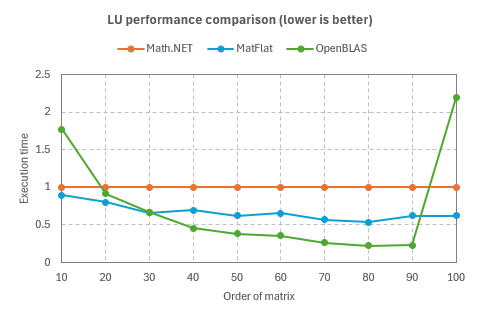
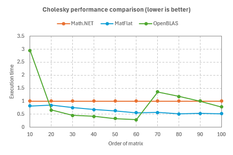
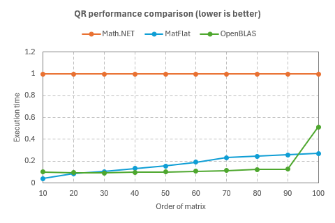

# MatFlat

This library aims to provide a subset of BLAS and LAPACK routines implemented in pure C#.

This library was created as a matrix decomposition implementation for [NumFlat](https://github.com/sinshu/numflat),
a general purpose numerical computing library written in pure C#.
If you're interested in numerical computing with C#, please check out [NumFlat](https://github.com/sinshu/numflat).

This library is based on the following great projects:

* [Math.NET Numerics](https://github.com/mathnet/mathnet-numerics)
* [Accord.NET](https://github.com/accord-net/framework)
* [Mapack Matrix Package](https://github.com/sinshu/mapack)

Currently the following routines are implemented:

* LU decomposition
* Cholesky decomposition
* QR decomposition
* Singular value decomposition
* Eigenvalue decomposition
* Generalized eigenvalue decomposition
* Forward and backward substitution
* Inverse matrix
* Matrix-vector multiplication
* Matrix-matrix multiplication
* Dot and outer product
* Vector norm


## Features

* Supports `float`, `double`, and `Complex` matrices.
* Faster than the managed matrix decompositions in Math.NET in many cases.
* Small code size, with no dependencies other than .NET 8.
* No internal multi-threaded optimization, making it safe to use in any multi-threaded code.
* BLAS and LAPACK-like interface that allows arbitrary leading dimension.


## Limitations

* Unsafe pointers are required, similar to the original BLAS and LAPACK routines.
* Only column-major order is supported.
* EVD and GEVD support only symmetric (Hermitian) matrices.


## Installation

.NET 8 is required.

[The NuGet package](https://www.nuget.org/packages/MatFlat) is available.

```ps1
Install-Package MatFlat
```

All the classes are in the `MatFlat` namespace.

```cs
using MatFlat;
```


## Performance

The performance of MatFlat is compared with that of Math.NET Numerics and OpenBLAS below.
The execution times of various `double` matrix decompositions for square matrices were measured.
The matrix sizes range from 10x10 to 100x100.
The plots show the execution times, with the execution time of Math.NET Numerics considered as 1.

### Measurement condition

The benchmarks were run under the following condition:

```
BenchmarkDotNet v0.13.12, Windows 11 (10.0.22631.3447/23H2/2023Update/SunValley3)
12th Gen Intel Core i7-12700K, 1 CPU, 20 logical and 12 physical cores
.NET SDK 8.0.202
  [Host]     : .NET 8.0.3 (8.0.324.11423), X64 RyuJIT AVX2
  DefaultJob : .NET 8.0.3 (8.0.324.11423), X64 RyuJIT AVX2
```

### LU decomposition

| Method   | Order | Mean         | Error       | StdDev      | Allocated |
|--------- |------ |-------------:|------------:|------------:|----------:|
| MathNet  | 10    |     356.3 ns |     1.03 ns |     0.91 ns |     104 B |
| MatFlat  | 10    |     318.4 ns |     1.55 ns |     1.45 ns |         - |
| OpenBlas | 10    |     632.7 ns |     3.47 ns |     3.25 ns |         - |
| MathNet  | 20    |   1,884.5 ns |     9.26 ns |     8.66 ns |     184 B |
| MatFlat  | 20    |   1,511.7 ns |     9.80 ns |     9.17 ns |         - |
| OpenBlas | 20    |   1,731.4 ns |     8.02 ns |     7.50 ns |         - |
| MathNet  | 30    |   6,141.2 ns |    22.08 ns |    20.65 ns |     264 B |
| MatFlat  | 30    |   4,062.0 ns |    24.81 ns |    23.21 ns |         - |
| OpenBlas | 30    |   4,109.6 ns |     9.17 ns |     8.13 ns |         - |
| MathNet  | 40    |  12,300.8 ns |    53.74 ns |    47.64 ns |     344 B |
| MatFlat  | 40    |   8,590.4 ns |    41.08 ns |    38.43 ns |         - |
| OpenBlas | 40    |   5,613.0 ns |    11.54 ns |    10.80 ns |         - |
| MathNet  | 50    |  25,438.9 ns |   112.91 ns |   105.61 ns |     424 B |
| MatFlat  | 50    |  15,788.6 ns |    69.35 ns |    64.87 ns |         - |
| OpenBlas | 50    |   9,751.5 ns |    21.30 ns |    19.92 ns |         - |
| MathNet  | 60    |  39,288.8 ns |   151.06 ns |   141.30 ns |     504 B |
| MatFlat  | 60    |  25,824.7 ns |    81.10 ns |    75.86 ns |         - |
| OpenBlas | 60    |  14,091.9 ns |    28.01 ns |    26.20 ns |         - |
| MathNet  | 70    |  69,376.4 ns |   315.96 ns |   280.09 ns |     584 B |
| MatFlat  | 70    |  39,621.0 ns |   173.00 ns |   161.82 ns |         - |
| OpenBlas | 70    |  18,460.6 ns |    34.77 ns |    32.52 ns |         - |
| MathNet  | 80    | 101,273.9 ns |   329.08 ns |   307.82 ns |     664 B |
| MatFlat  | 80    |  54,074.5 ns |   273.94 ns |   256.24 ns |         - |
| OpenBlas | 80    |  22,488.7 ns |    64.39 ns |    60.23 ns |         - |
| MathNet  | 90    | 131,540.5 ns |   671.69 ns |   628.30 ns |     744 B |
| MatFlat  | 90    |  82,170.1 ns |   422.07 ns |   394.81 ns |         - |
| OpenBlas | 90    |  30,344.1 ns |    46.13 ns |    40.89 ns |         - |
| MathNet  | 100   | 180,358.0 ns |   359.72 ns |   336.48 ns |     824 B |
| MatFlat  | 100   | 111,801.6 ns |   136.84 ns |   128.00 ns |         - |
| OpenBlas | 100   | 396,249.3 ns | 7,715.05 ns | 7,922.79 ns |         - |



### Cholesky decomposition

| Method   | Order | Mean         | Error       | StdDev      | Allocated |
|--------- |------ |-------------:|------------:|------------:|----------:|
| MathNet  | 10    |     200.9 ns |     0.60 ns |     0.54 ns |     664 B |
| MatFlat  | 10    |     163.4 ns |     0.85 ns |     0.79 ns |         - |
| OpenBlas | 10    |     592.0 ns |     2.33 ns |     2.18 ns |      24 B |
| MathNet  | 20    |   1,074.6 ns |     5.24 ns |     4.91 ns |    1304 B |
| MatFlat  | 20    |     907.6 ns |     4.37 ns |     4.08 ns |         - |
| OpenBlas | 20    |     704.4 ns |     2.83 ns |     2.65 ns |      24 B |
| MathNet  | 30    |   3,289.6 ns |    15.63 ns |    14.62 ns |    1944 B |
| MatFlat  | 30    |   2,469.6 ns |    12.36 ns |    11.56 ns |         - |
| OpenBlas | 30    |   1,486.7 ns |     2.35 ns |     2.20 ns |      24 B |
| MathNet  | 40    |   7,381.9 ns |    29.87 ns |    27.94 ns |    2584 B |
| MatFlat  | 40    |   5,024.0 ns |    25.70 ns |    24.04 ns |         - |
| OpenBlas | 40    |   3,076.4 ns |     5.84 ns |     5.47 ns |      24 B |
| MathNet  | 50    |  14,076.3 ns |    70.74 ns |    66.17 ns |    3224 B |
| MatFlat  | 50    |   8,803.8 ns |    46.68 ns |    43.66 ns |         - |
| OpenBlas | 50    |   4,668.1 ns |     9.87 ns |     9.23 ns |      24 B |
| MathNet  | 60    |  25,819.8 ns |    81.21 ns |    75.97 ns |    3864 B |
| MatFlat  | 60    |  14,346.9 ns |    36.56 ns |    34.20 ns |         - |
| OpenBlas | 60    |   7,256.3 ns |    12.05 ns |    11.27 ns |      24 B |
| MathNet  | 70    |  38,900.2 ns |   145.13 ns |   135.76 ns |    4504 B |
| MatFlat  | 70    |  21,853.4 ns |   119.00 ns |   111.31 ns |         - |
| OpenBlas | 70    |  52,870.4 ns | 1,056.20 ns | 2,707.44 ns |      24 B |
| MathNet  | 80    |  62,603.4 ns |   358.44 ns |   335.29 ns |    5144 B |
| MatFlat  | 80    |  31,830.3 ns |   149.25 ns |   139.61 ns |         - |
| OpenBlas | 80    |  73,786.8 ns |   609.29 ns |   508.78 ns |      24 B |
| MathNet  | 90    |  83,681.4 ns |   286.78 ns |   268.26 ns |    5784 B |
| MatFlat  | 90    |  44,244.4 ns |   223.02 ns |   208.62 ns |         - |
| OpenBlas | 90    |  84,149.8 ns | 1,003.21 ns |   938.41 ns |      24 B |
| MathNet  | 100   | 115,551.9 ns |   672.86 ns |   596.47 ns |    6424 B |
| MatFlat  | 100   |  59,350.4 ns |   334.89 ns |   313.25 ns |         - |
| OpenBlas | 100   |  89,611.6 ns | 1,711.85 ns | 1,681.26 ns |      24 B |



### QR decomposition

| Method   | Order | Mean           | Error        | StdDev       | Allocated |
|--------- |------ |---------------:|-------------:|-------------:|----------:|
| MathNet  | 10    |    16,395.9 ns |     60.26 ns |     53.41 ns |   29206 B |
| MatFlat  | 10    |       680.4 ns |      1.53 ns |      1.43 ns |         - |
| OpenBlas | 10    |     1,655.8 ns |      4.50 ns |      4.21 ns |         - |
| MathNet  | 20    |    54,226.6 ns |    549.03 ns |    513.57 ns |   68867 B |
| MatFlat  | 20    |     4,645.9 ns |     22.98 ns |     21.49 ns |         - |
| OpenBlas | 20    |     5,148.5 ns |     20.61 ns |     19.28 ns |         - |
| MathNet  | 30    |   118,586.5 ns |    668.11 ns |    592.27 ns |  114887 B |
| MatFlat  | 30    |    12,199.9 ns |     56.84 ns |     53.17 ns |         - |
| OpenBlas | 30    |    10,844.1 ns |     37.50 ns |     35.08 ns |         - |
| MathNet  | 40    |   200,877.5 ns |    430.67 ns |    381.78 ns |  156810 B |
| MatFlat  | 40    |    26,532.9 ns |    163.90 ns |    153.31 ns |         - |
| OpenBlas | 40    |    19,615.5 ns |     42.48 ns |     37.66 ns |         - |
| MathNet  | 50    |   302,011.2 ns |  1,808.26 ns |  1,691.45 ns |  201012 B |
| MatFlat  | 50    |    47,273.9 ns |    308.30 ns |    288.38 ns |         - |
| OpenBlas | 50    |    30,619.7 ns |     61.78 ns |     54.77 ns |         - |
| MathNet  | 60    |   426,465.4 ns |  7,785.35 ns |  7,282.42 ns |  242501 B |
| MatFlat  | 60    |    80,619.4 ns |    307.43 ns |    272.53 ns |         - |
| OpenBlas | 60    |    45,598.1 ns |     74.76 ns |     69.93 ns |         - |
| MathNet  | 70    |   584,892.0 ns |  5,543.57 ns |  4,914.23 ns |  286236 B |
| MatFlat  | 70    |   135,624.1 ns |    526.02 ns |    492.04 ns |         - |
| OpenBlas | 70    |    66,024.7 ns |    143.80 ns |    134.51 ns |         - |
| MathNet  | 80    |   764,410.9 ns | 14,198.79 ns | 14,581.12 ns |  324848 B |
| MatFlat  | 80    |   187,239.2 ns |  1,068.00 ns |    999.00 ns |         - |
| OpenBlas | 80    |    93,071.6 ns |    261.52 ns |    244.62 ns |         - |
| MathNet  | 90    | 1,025,887.2 ns |  8,722.75 ns |  8,159.26 ns |  366159 B |
| MatFlat  | 90    |   264,657.7 ns |    509.46 ns |    451.62 ns |         - |
| OpenBlas | 90    |   130,194.9 ns |    392.21 ns |    366.88 ns |         - |
| MathNet  | 100   | 1,270,333.6 ns | 17,520.01 ns | 16,388.22 ns |  406464 B |
| MatFlat  | 100   |   345,101.4 ns |  2,451.92 ns |  2,293.52 ns |         - |
| OpenBlas | 100   |   650,895.2 ns | 10,389.01 ns |  8,675.29 ns |         - |



### Singular value decomposition

| Method   | Order | Mean         | Error      | StdDev     | Allocated |
|--------- |------ |-------------:|-----------:|-----------:|----------:|
| MathNet  | 10    |    10.369 μs |  0.0390 μs |  0.0365 μs |    1136 B |
| MatFlat  | 10    |     6.261 μs |  0.0190 μs |  0.0168 μs |         - |
| OpenBlas | 10    |     8.218 μs |  0.0441 μs |  0.0413 μs |      48 B |
| MathNet  | 20    |    60.701 μs |  0.2754 μs |  0.2576 μs |    3776 B |
| MatFlat  | 20    |    34.161 μs |  0.1679 μs |  0.1570 μs |         - |
| OpenBlas | 20    |    32.076 μs |  0.1371 μs |  0.1282 μs |      48 B |
| MathNet  | 30    |   165.329 μs |  0.6463 μs |  0.5729 μs |    8016 B |
| MatFlat  | 30    |    97.288 μs |  0.2930 μs |  0.2741 μs |         - |
| OpenBlas | 30    |    80.800 μs |  0.2287 μs |  0.2028 μs |      48 B |
| MathNet  | 40    |   359.838 μs |  1.3219 μs |  1.2365 μs |   13856 B |
| MatFlat  | 40    |   212.872 μs |  0.6934 μs |  0.6486 μs |         - |
| OpenBlas | 40    |   159.768 μs |  0.3706 μs |  0.3285 μs |      48 B |
| MathNet  | 50    |   660.509 μs |  2.0123 μs |  1.8823 μs |   21296 B |
| MatFlat  | 50    |   392.559 μs |  1.3545 μs |  1.2670 μs |         - |
| OpenBlas | 50    |   261.269 μs |  1.3967 μs |  1.3064 μs |      48 B |
| MathNet  | 60    | 1,144.149 μs |  4.0893 μs |  3.8251 μs |   30337 B |
| MatFlat  | 60    |   664.029 μs |  3.4705 μs |  3.2463 μs |       1 B |
| OpenBlas | 60    |   431.300 μs |  0.8319 μs |  0.7782 μs |      48 B |
| MathNet  | 70    | 1,832.909 μs |  9.0039 μs |  8.4223 μs |   40976 B |
| MatFlat  | 70    | 1,073.801 μs |  3.6979 μs |  3.4590 μs |       1 B |
| OpenBlas | 70    |   642.370 μs |  1.4747 μs |  1.3794 μs |      48 B |
| MathNet  | 80    | 2,600.145 μs | 16.8514 μs | 15.7628 μs |   53218 B |
| MatFlat  | 80    | 1,542.437 μs |  8.6110 μs |  8.0548 μs |       1 B |
| OpenBlas | 80    |   918.765 μs |  2.7510 μs |  2.5733 μs |      48 B |
| MathNet  | 90    | 3,615.089 μs | 16.6810 μs | 15.6034 μs |   67058 B |
| MatFlat  | 90    | 2,136.354 μs | 12.5674 μs | 11.7555 μs |       3 B |
| OpenBlas | 90    | 1,319.471 μs |  2.5227 μs |  2.3597 μs |      49 B |
| MathNet  | 100   | 4,905.273 μs | 28.3718 μs | 26.5390 μs |   82499 B |
| MatFlat  | 100   | 3,036.419 μs | 13.4627 μs | 11.9343 μs |       3 B |
| OpenBlas | 100   | 2,625.432 μs | 33.5104 μs | 31.3456 μs |      50 B |


## Todo

* ✅ LU decomposition
* ✅ Cholesky decomposition
* ✅ QR decomposition
* ✅ Singular value decomposition
* ✅ Eigenvalue decomposition
* ✅ Generalized eigenvalue decomposition
* ✅ Forward and backward substitution
* ✅ Inverse matrix
* ✅ Matrix-vector multiplication
* ✅ Matrix-matrix multiplication
* ✅ Dot and outer product
* ✅ Vector norm


## License

MatFlat is available under [the MIT license](LICENSE.txt).
